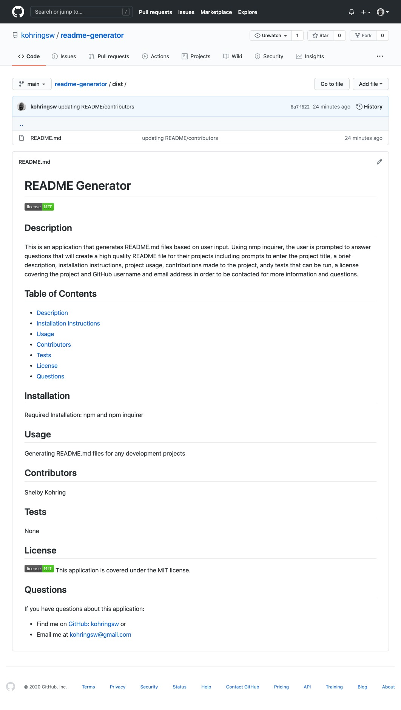

# README Generator

## Description
This is an application that generates README.md files based on user input. Using nmp inquirer, the user is prompted to answer questions that will create a high quality README file for their projects including prompts to enter the project title, a brief description, installation instructions, project usage, contributions made to the project, andy tests that can be run, a license covering the project and GitHub username and email address in order to be contacted for more information and questions. 

- Link: [See README Generator Video Tutorial Here](https://drive.google.com/file/d/1MfD7M7h0JJu5EZ6-G2Tudfdguchzllp9/view)

- Link: [See the GitHub Repository for this application here](https://github.com/kohringsw/readme-generator.git)

## Table of Contents
- [Description](#description)
- [Installation Instructions](#installation)
- [Usage](#usage)
- [Contributors](#contributors)
- [Tests](#tests)
- [License](#license)
- [Questions](#questions)

## Installation Instructions
- Required Installation
  - npm
  - npm inquirer

## Usage
This application can be used to generate README.md files for any development projects.

## Contributors
Shelby Kohring

## Tests
None

## License 
None

## Questions
If you have questions about this application: 
- Find me on [GitHub: kohringsw](https://github.com/kohringsw) or 
- Email me at [kohringsw@gmail.com](mailto:kohringsw@gmail.com)